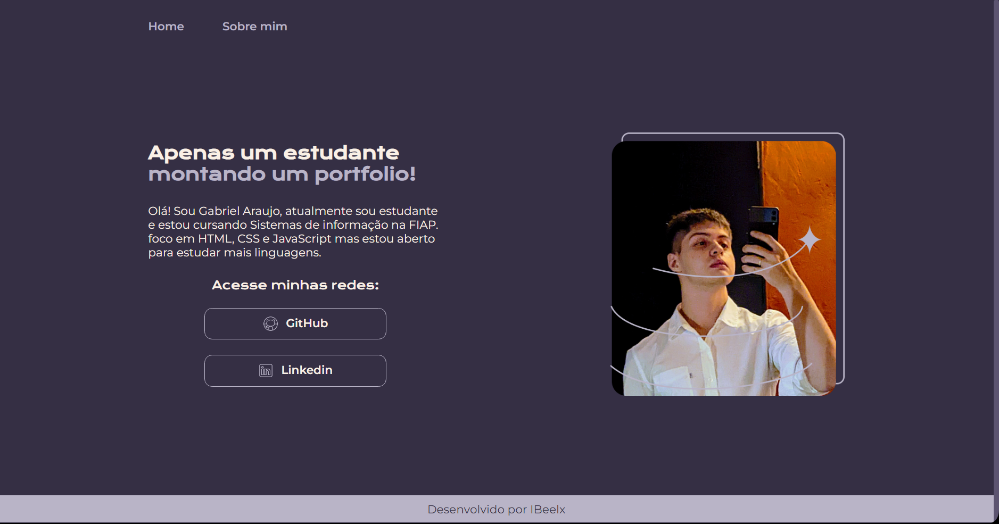
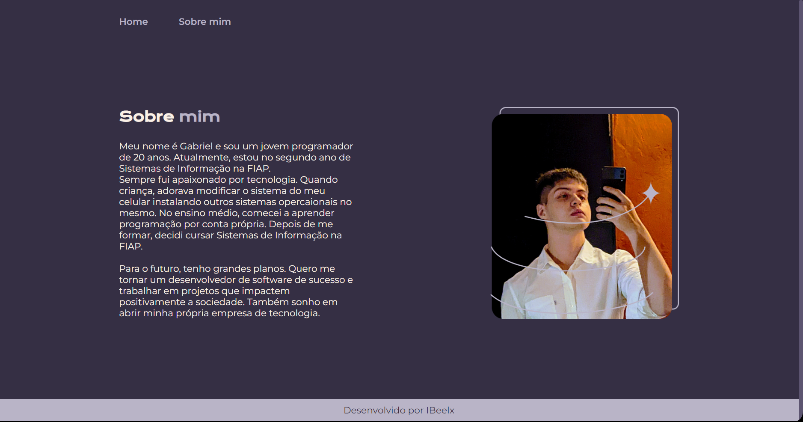

<h1 align = "center"> Portfolio <h1>
<h3 align = "center"> By Bieelx <h3>

Portfolio feito com a ajuda dos cursos HTML e CSS: cabeçalho, footer e variáveis CSS, esse curso atualiza um projeto anterior, mas como muda muitas coisas resolvi coloca-lo em um repositório solo.  

 
 
 
 
 

 
 
 
 
 
 
 
 
 
 

## 🚀 Tecnologias

Esse projeto foi desenvolvido com as seguintes tecnologias:
- HTML
- CSS

## 💻 Projeto
Atualize seu portfolio.
